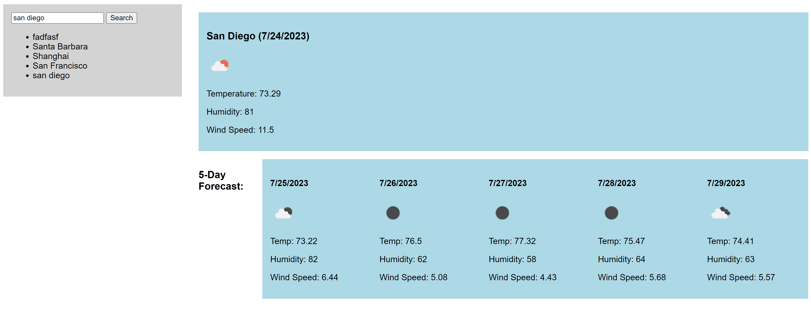

# Weather Dashboard

## Description

This is a weather dashboard designed to utilize a 3rd party api to accurately provide a 5 day forecast for any city searched. It is designed to run in the browser and will feature dynamically updated html and css.

- What was your motivation?
To create an app via the utilization of a 3rd party api, and further hone my skills in js development via novelty solutions to simple tasks.
- Why did you build this project? (Note: the answer is not \"Because it was a homework assignment.")
I built this project in hope of understanding how to implement a 3rd party api that can access data in real time, so that it preps me better for future projects. 
- What problem does it solve?
This app helps the user know the weather ahead of time, with real time data that is accessible for any point in the world. 
- What did you learn?
To be able to use a 3rd party api is to be able to do so much more with your sites than previously capable. It opens up a whole new world of possibility in web development for me. 

## Installation

Simply go to the site link or right click open the index file on your local drive, to see it open in a browser.

## Usage

Open the app, click the search bar, type in a city name, and press enter. There should now be a dashboard showing the 5 day forecast for that city, as well as the city name being saved under the search bar for more easy accessibility the next time you want to check  its specific weather. 

## Credits

n/a

OpenWeather Api. Located at https://openweathermap.org/api

n/a

## License

https://openweathermap.org/api
